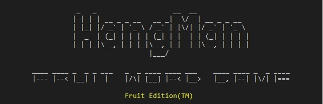
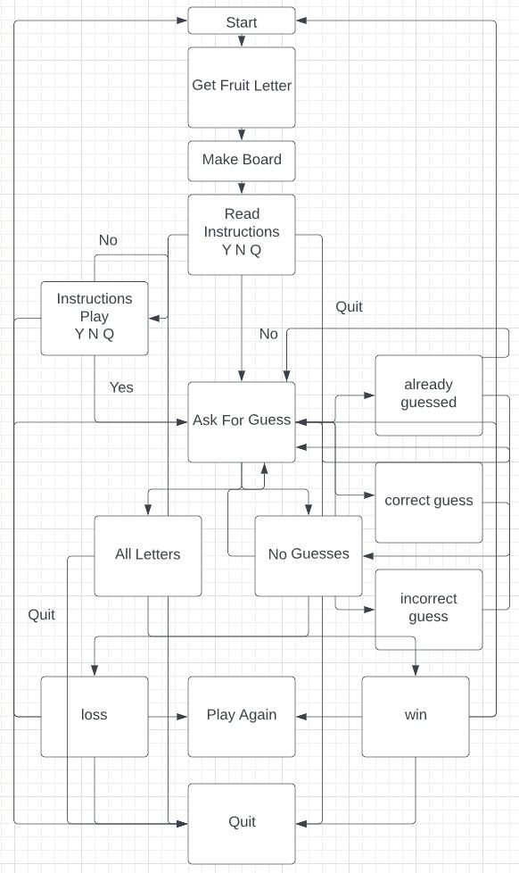
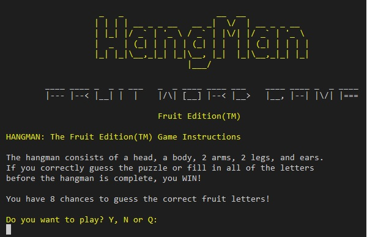
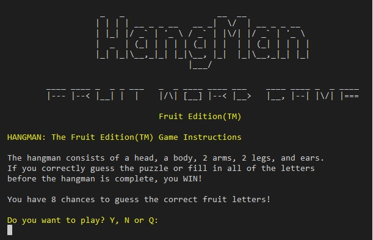

# HANGMAN: The Fruit Edition(TM)

In this game, HANGMAN: The Fruit Edition(TM), players try to guess all letters of a word based on the different types of fruit.

This game is based on the Hangman, pen and paper game that possibly stretches back to the 1890s.

Stories claim that criminals sentenced to death by hanging could demand the "Rite of Words and Life."

First, the Executioner would pick a five-letter word, marking correctly guessed letters on the dashes of a board.
At every incorrect guess, the Executioner would use a sledgehammer or axe to knock away a single leg of the stand. Five wrong guesses, thus, meant that the criminal was hung.

If the entire word were filled in correctly or guessed, the condemned would be set free from that sentence and not tried again for that crime. The irony was that almost all of those criminals were illiterate.

The TV show Wheel of Fortune, based on the game, has been broadcast worldwide since the 1960s.

View the live project here

## How to Play

Players guess letters of an unrevealed fruit-themed word and then draw an head, torso, arms, legs and ears of a stick figure hanging from gallows for every incorrect guess.

If the player draws all body parts and the word still hasn't been found, the player loses.

* Players have 8 attempts to guess the fruit word. Players are asked for their guess, in single letter format.

* After every attempt (unless successful) the player is asked to guess a letter that is contained in the fruit word.

* Every incorrect guess adds to the letters tried, a correct guess adds to the hidden word, revealing the location of the correctly guessed letter in the fruit word.

* A hangman board displays with the number of guesses left, with a win or lose message.

## User Experience

## Features

### Logo

* Pyfiglet is installed and used to import pyfiglet, which generates the Hangman text using the standard font. The cybersmall font was used for the secondary text, with centred yellow text. A logo-display function was created and stored within the messages.py file and imported for use when needed.

## Features to Implement

## Design

### Flow Chart

## Technologies

## Python Libraries

### Built-in Python Libraries

* OS was imported to create a clear function to clear the terminal. Both system and name being imported for use in the clear function. The clear function improves the user experience when replaying games by removing the previous game and previous menus and making the screen clearer and more structured.

* random was imported to access the random built-in method for random numbers using randint() method. This is used to generate the random pick of the fruit words from the words.py file.

* sys was imported to use in the delete last line function.

* time was imported to use in the time.sleep commands in the game loading screen and various other places.

### Others

* Colorama was imported for use in coloring fonts and game bars in python fuctions.
* Pyfiglet was used for adding ascii art to logo.
* termcolor was used to highlight both win and loss message.py functions.

## Testing

## Bugs and Fixes

### PYLINT Error when using range length line 176

Error was "Consider using enumerate instead of iterating with range and lenpylint((consider-using-enumerate))"

            for i in range(len(random_word_from_list)):
                if random_word_from_list[i] not in correct_guess:
                    have_all_letters = False
                    break

No need to use range length, can just use enumerate to iterate over it.

Using for k_r, v_r because enumerate returns the count and the value, not just the current index.

            for k_r, v_r in enumerate(random_word_from_list):
                if v_r not in correct_guess:
                    print(k_r)  # print then clear
                    clear()
                    have_all_letters = False
                    break

### Color Bleed

The see_instructions fuction user input color was bleeding into the instructions function
logo-display, causing the logo to be yellow.

    def instructions():
        clear()
        logo_display()
        game_rules()
        user_input = input(
            f"{Fore.YELLOW}" + f"Do you want to play? Y, N or Q:{Fore.RESET}\n"
        ).lower()
        if user_input == "y":
            clear()
            main_game()

        elif user_input == "n":
            clear()
            logo_display()
            exit_message()
            exit()

        elif user_input == "q":
            clear()
            logo_display()
            exit_message()
            exit()

        else:
            clear()
            logo_display()
            game_yn()
            see_instructions()

Added a Fore.RESET print and created a delete_last_line fuction to delete last line to clear color bleed.

    print(Fore.RESET)  # reset color
    delete_last_line()

## Deployment

### Template

* A repository called 'CI-P3-FruitHM' was created using the *[Code Institute Python Essentials Template](https://github.com/Code-Institute-Org/python-essentials-template)*.

## Version Control

## Credits

### History of Hangman

* Used *[History of Hangman](https://www.ludozofi.com/home/games/hangman/)* for information on the history of Hangman.

### Python Formatter

* Used *[Online Python Formatter](https://www.tutorialspoint.com/online_python_formatter.htm)* to correctly format python code.

### Python Reference

* Used *[W3Schools Python](https://www.w3schools.com/python/default.asp)* for reference with python use.

### Pyfiglet

* Used *[Pyfiglet](https://github.com/pwaller/pyfiglet/)* to create ascii art for the logo.
* Used *[Code Speedy](https://www.codespeedy.com/pyfiglet-in-python/)* for code example of pyfiglet.

### Colorama

* Used *[Colorama](https://pypi.org/project/colorama/)* to produce colored terminal text.
* Used *[Stackoverflow](https://stackoverflow.com/questions/43649051/a-way-to-not-have-to-reset-the-color-style-in-colorama-every-time)* to troubleshoot colorama color reset.

### Termcolor

* Used *[Termcolor](https://pypi.org/project/termcolor/)* to create ascii art for the logo.
* Used *[TowardsDataScience](https://towardsdatascience.com/prettify-your-terminal-text-with-termcolor-and-pyfiglet-880de83fda6b)* to create termcolor background.

### pylint

* Used *[pylint](https://pypi.org/project/pylint/)* to check for errors, enforce a coding standard, and refactoring.

### Command Line Interfaces with Python

* Used *[Code Burst.io](https://codeburst.io/building-beautiful-command-line-interfaces-with-python-26c7e1bb54df)* for reference.

### Tutorials

Some helpful tutorials that were reference to help with coding some of the design and structure:

* *[Data Flair Hangman Game Python](https://data-flair.training/blogs/hangman-game-python-code/)*
* *[Geeks for Geeks Hangman Game Python](https://www.geeksforgeeks.org/hangman-game-python/)*
* *[Invent with Python Hangman Game Python](https://inventwithpython.com/invent4thed/chapter8.html)*
* *[Medium.com Hangman Game with Python](https://medium.com/@branzoldecode/hangman-game-with-python-fbd64e99a96f)*

### Clear Screen Function

* Used *[Geeks for Geeks Clear Screen Python](https://www.geeksforgeeks.org/clear-screen-python/)* to help create the clear screen function.

### Fruit Names

* Used *[7esl.com](https://7esl.com/fruits-vocabulary-english/)* for fruit words to use in words.py.

## Reminders

* Your code must be placed in the `run.py` file
* Your dependencies must be placed in the `requirements.txt` file
* Do not edit any of the other files or your code may not deploy properly

## Creating the Heroku app

When you create the app, you will need to add two buildpacks from the _Settings_ tab. The ordering is as follows:

1. `heroku/python`
2. `heroku/nodejs`

You must then create a _Config Var_ called `PORT`. Set this to `8000`

If you have credentials, such as in the Love Sandwiches project, you must create another _Config Var_ called `CREDS` and paste the JSON into the value field.

Connect your GitHub repository and deploy as normal.

## Constraints

The deployment terminal is set to 80 columns by 24 rows. That means that each line of text needs to be 80 characters or less otherwise it will be wrapped onto a second line.
