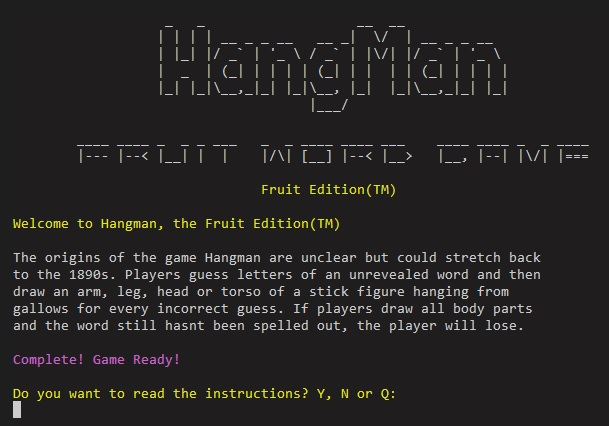
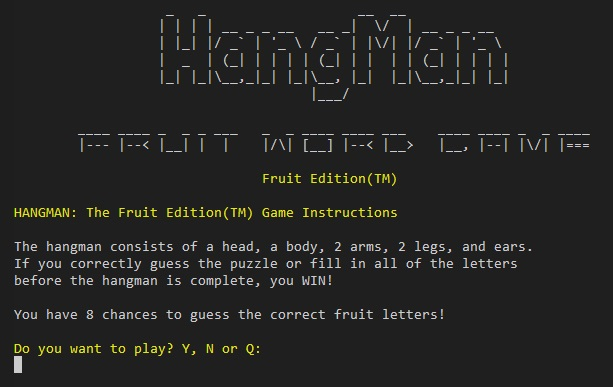

# HANGMAN: The Fruit Edition(TM)

In this game, HANGMAN: The Fruit Edition(TM), players try to guess all letters of a word based on the different types of fruit.

This game is based on the Hangman, pen and paper game that possibly stretches back to the 1890s.

Stories claim that criminals sentenced to death by hanging could demand the *"Rite of Words and Life."*

First, the Executioner would pick a five-letter word, marking correctly guessed letters on the dashes of a board. Then, at every incorrect guess, the Executioner would use a sledgehammer or axe to knock away a single leg of the stand. With five wrong guesses, the criminal was hung.
If the entire word were filled in correctly or guessed, the condemned would be set free from that sentence and not tried again for that crime. The irony was that almost all of those criminals were illiterate.

The TV show Wheel of Fortune, based on the game, has been broadcast worldwide since the 1960s.

View the live project *[here](https://ci-p3-fruithm.herokuapp.com/)*

## How to Play

Players guess the letters of an unrevealed fruit-themed word and then draw a head, torso, arms, legs and ears of a stick figure hanging from gallows for every incorrect guess.

If the player draws all body parts and the word still hasn't been found, the player loses.

* A hangman board displays the number of guesses left.
* Players have eight attempts to guess the fruit word. Players are asked for their guesses in single letter format.
* After every attempt (unless successful), the player is asked to guess a letter contained in the fruit word.
* Every incorrect guess adds to the letters tried, and a correct guess adds to the hidden word, revealing the location of the correctly guessed letter in the fruit word.

## User Stories

This game aims to give the user a straightforward, attractive, understandable, and repeatedly playable experience.

As a User, I want to:

* play the game clearly across different devices
* play an attractive game
* understand how to play the game
* have the choice to easily play again or quit
* alert to incorrect input
* know what incorrect input has been input
* know how many attempts are left
* play a game that is not timed

As a Site Administrator, I want to:

* have the random text file, player messages, and images separated into different files to facilitate easy editing
* offer the player a straightforward and understandable game

## Features

### Logo

* Pyfiglet is installed and used to import pyfiglet, which generates the Hangman text using the standard font. The cybersmall font was used for the secondary text, with centred yellow text. A logo-display function was created and stored within the art.py file and imported for use when needed.

### Game Title

* Game Title is split into a function and imported from messages.py to play in the game loading function.

### Game Loading

* Game Loading uses the time function in conjunction with the delete last line function to display a game loading screen on the welcome screen.

        def game_loading():
            ''' This function produces a Game Loading time moving text line '''
            clear()
            logo_display()
            print(f"{Fore.YELLOW}Welcome to Hangman, the Fruit Edition(TM)\n")
            game_title()
            print("Please Wait! Game Loading.")
            time.sleep(1)
            delete_last_line()
            print(f"{Fore.RED}Drawing HANGMAN Board.")
            time.sleep(0.5)
            delete_last_line()
            print(f"{Fore.RED}Drawing HANGMAN Board..")
            time.sleep(1)
            delete_last_line()
            print(f"{Fore.RED}Drawing HANGMAN Board...")
            time.sleep(0.5)
            delete_last_line()
            print(f"{Fore.RED}Drawing HANGMAN Board....")
            time.sleep(0.5)
            delete_last_line()
            print(f"{Fore.MAGENTA}HANGMAN Board Done!")
            time.sleep(1)
            delete_last_line()
            print("Game Loading..")
            time.sleep(0.5)
            delete_last_line()
            print(f"{Fore.RED}Calculating draw distance.")
            time.sleep(1)
            delete_last_line()
            print("Game Loading...")
            time.sleep(1)
            delete_last_line()
            print(f"{Fore.RED}Generating Random Fruit Word.")
            time.sleep(1.0)
            delete_last_line()
            print("Game Loading....")
            time.sleep(0.2)
            delete_last_line()
            print(f"{Fore.MAGENTA}Fruit Word Selected!")
            time.sleep(0.5)
            delete_last_line()
            print("Game Loading.....")
            time.sleep(0.5)
            delete_last_line()
            print("Game Loading......")
            time.sleep(0.5)
            delete_last_line()
            print("Game Loading.......")
            time.sleep(0.2)
            delete_last_line()
            print(f"{Fore.MAGENTA}Complete! Game Ready!")
            print("")

### Read Instructions

* The game displays the message, "Do you want to read the instructions? Y, N or Q.
* Choosing Y brings you to view the instructions.
* Choosing N brings you to the main game.
* Choosing Q quits the game.

### Game Instructions

* The game displays the game instructions, including the player's number of guesses.
* The game displays, "Do you want to play? Y, N, Q.
* Choosing Y brings you to the main game.
* Choosing N or Q quits the game.

### Main Game

* The main game screen displays the hangman board, with the current hangman position and number of tries left. (1 and 2)
* Letters tried supplies the already and incorrect tried letters. (3)
* The number of letters in the fruit word is displayed. (4)
* '~' is used to space out the missing and already guessed letters. (4)
* The game displays a message asking the player to pick a fruit's letter. (5)

## Features to Implement

* This game it would be useful to have a high scores and username option.

* This game could be made harder for different levels, and the word number could be increased or fewer attempts given.

* Expand the game and allow users to choose words based on a type of fruit or rare fruit.

## Design

### Flow Chart

## Technologies

## Python Libraries

### Built-in Python Libraries

* OS was imported to create a clear function to clear the terminal. Both system and name being imported for use in the clear function. The clear function improves the user experience when replaying games by removing the previous game and previous menus and making the screen clearer and more structured.

* random was imported to access the random built-in method for random numbers using randint() method. This is used to generate the random pick of the fruit words from the words.py file.

* sys was imported to use in the delete last line function.

* time was imported to use in the time.sleep commands in the game loading screen and various other places.

### Others

* Colorama was imported for use in coloring fonts and game bars in python functions.
* Pyfiglet was used for adding ascii art to logo.
* termcolor was used to highlight both win and loss message.py functions.

## Testing

* Lines that were excessively long, abnormalities with spacing, and single- or double-line spacing were all addressed as they surfaced. As a consequence, the code was generally clean and devoid of errors and defects when final testing began.

* Techniques like print() were used to check for flaws as the code was being created. It was possible to verify that everything was operating as it should and that functions like selecting a random word from words.py were correctly displayed as a result.

* To enable the player to understand why their decision was incorrect, all user inputs were validated and printed back to the screen.

### Instructions Option Screen

Input is from the question, Do you want to want to read the instructions? Y, N, or Q.

**Expected:** Any input outside of Y for Yes, No for No, or Quit for Quit returns an error.

**Actual:** Any input out Y for Yes, No for No, or Q for Quit returned an error.

#### nn text string

#### @@ symbols

### Play Again Option Screen

Input is from the question, Do you want to Play Again?

**Expected:** Any input outside of Y for Yes, No for No, or Quit for Quit returns an error.

**Actual:** Any input out Y for Yes, No for No, or Q for Quit returned an error.

#### Play Again nn text string

#### Play Again @@ symbols

### Main Game Input Error Checking

Input is a double letter in the alphabet.

**Expected:** Any input outside of a single letter of the alphabet returns an error.

**Actual:** A input outside of a single letter of the alphabet returned an error.

#### Main Game Input Single Letter

#### Main Game Input Already Guessed

Input is a letter already guessed from the correct guessed letter display.

**Expected:** Any correctly guessed letter returns an error.

**Actual:** The correctly guessed letter returned an error.

#### Main Game Not In The Alphabeta

Input is a special character or a number.

**Expected:** Any input with a special character or a number returns an error.

**Actual:** The special character returned an error.

### Validator Testing

The python files were verified using pep8 online. Every Python file was examined, and there were no mistakes found.

## Bugs and Fixes

### PYLINT Error when using range length line 176

Error was "Consider using enumerate instead of iterating with range and lenpylint((consider-using-enumerate))"

            for i in range(len(random_word_from_list)):
                if random_word_from_list[i] not in correct_guess:
                    have_all_letters = False
                    break

There is no need to use range length, can just use enumerate to iterate over it.

Using for k_r, v_r because enumerate returns the count and the value, not just the current index.

            for k_r, v_r in enumerate(random_word_from_list):
                if v_r not in correct_guess:
                    print(k_r)  # print then clear
                    clear()
                    have_all_letters = False
                    break

### Color Bleed

The main function user input color was bleeding into the instructions function
logo-display, causing the logo to be yellow.

        def instructions():
            clear()
            logo_display()
            game_rules()
            user_input = input(
            f"{Fore.YELLOW}" + f"Do you want to play? Y, N or Q:{Fore.RESET}\n"
            ).lower()
            if user_input == "y":
                clear()
                main_game()

            elif user_input == "n":
                clear()
                print(Fore.RESET)  # reset color
                delete_last_line()
                logo_display()
                exit_message()
                exit()    

Added a Fore.RESET print and created a delete_last_line function to delete last line to clear color bleed.

    print(Fore.RESET)  # reset color
    delete_last_line()

## Deployment

### Template

* A repository called 'CI-P3-FruitHM' was created using the *[Code Institute Python Essentials Template](https://github.com/Code-Institute-Org/python-essentials-template)*.

### Version Control

Both *[Visual Studio](https://visualstudio.microsoft.com/)* code editor and *[GitPod](https://gitpod.io/workspaces)* were used to create this site and then pushed to the **GitHub** remote repository named ‘*[CI-P3-FruitHM](https://github.com/mickymacirl/CI-P3-FruitHM)*’.

The following commands were used to push code to the remote repository:

1. *git add .* was used to stage all files for commit changes.

2. *git commit -m “commit message”* was used to add the changes to the local repository for upload during a push.

3. *git push* was used to push all local changes to the remote repository on **GitHub**.

### Deploying New Changes

Once **GitHub Pages** is set up, normal **GithHub** flow updates the live page.

### Forking the Repository

Forking creates a copy of the repository to view and/or make changes without affecting the original.

Below are the steps required:

1. In **GitHub**, access the specific **GitHub** Repository - *[Hangman: Fruit Edition](https://github.com/mickymacirl/CI-P3-FruitHM)*
2. You will find and click the **"Fork"** button on the top right of the repository page underneath the user icon.
3. You will have successfully created a copy of the original repository within the logged-in **GitHub** account.

### Clone the 'Hangman: The Fruit Edition(TM)' GitHub Code Repository locally

1. Go to the page of the repository that you want to clone, the **CI-P3-FruitHM GitHub** site: *[here](https://github.com/mickymacirl/CI-P3-FruitHM)*
2. Click on the **“Code”** menu and copy the URL.
3. Use the git clone command along with the copied URL.
4. git clone <https://github.com/USERNAME/REPOSITORY>

### Heroku Deployment

This game is deployed via Heroku.

The steps for deployment are outlined in the Code Institute Template referenced above and are required.

Pip3 freeze > requirements.txt was used to add imports for pyfiglet, termcolor and Colorama prior to deployment to Heroku.

1. Open an existing **Heroku** account or create a new one.  
2. Next, choose to **Create New App** from the drop-down menu and the New button on the dashboard's upper right corner.
3. You have to enter a distinct app name.
4. Next, please select your region.
5. Click on the **Create App button**.
6. The project's **Deploy Tab** will appear on the following page.
7. **Config Vars** is located after selecting the **Settings Tab**.
8. Click **Reveal Config Vars**, type **port** and **8000** into the Key and Value boxes, and then click **Add**.
9. Next, click **Add Buildpack** in the Buildpack section, choose **Python**, and then click **Save Changes**.
10. Next, click **Add Buildpack** in the Buildpack section, choose **Node.js**, and then click **Save Changes**.
11. Scroll to the top of the page and now choose the **Deploy tab**.
12. Select **GitHub**.
13. Connect to **GitHub**.
14. Search for the repository name and choose the connect button.
15. Select the **Deploy** button at the bottom of the page and select the preferred deployment type, **Automatic** or **Manual Deploys**.

## Credits

### History of Hangman

* Used *[History of Hangman](https://www.ludozofi.com/home/games/hangman/)* for information on the history of Hangman.

### Python Formatter

* Used *[Online Python Formatter](https://www.tutorialspoint.com/online_python_formatter.htm)* to correctly format python code.

### Python Reference

* Used *[W3Schools Python](https://www.w3schools.com/python/default.asp)* for reference with python use.

### Pyfiglet

* Used *[Pyfiglet](https://github.com/pwaller/pyfiglet/)* to create ascii art for the logo.
* Used *[Code Speedy](https://www.codespeedy.com/pyfiglet-in-python/)* for code example of pyfiglet.

### Colorama

* Used *[Colorama](https://pypi.org/project/colorama/)* to produce colored terminal text.
* Used *[Stackoverflow](https://stackoverflow.com/questions/43649051/a-way-to-not-have-to-reset-the-color-style-in-colorama-every-time)* to troubleshoot colorama color reset.

### Termcolor

* Used *[Termcolor](https://pypi.org/project/termcolor/)* to create ascii art for the logo.
* Used *[TowardsDataScience](https://towardsdatascience.com/prettify-your-terminal-text-with-termcolor-and-pyfiglet-880de83fda6b)* to create termcolor background.

### pylint

* Used *[pylint](https://pypi.org/project/pylint/)* to check for errors, enforce a coding standard, and refactoring.

### Command Line Interfaces with Python

* Used *[Code Burst.io](https://codeburst.io/building-beautiful-command-line-interfaces-with-python-26c7e1bb54df)* for reference.

### Tutorials

Some helpful tutorials that were a reference to help with coding some of the design and structure:

* *[Data Flair Hangman Game Python](https://data-flair.training/blogs/hangman-game-python-code/)*
* *[Geeks for Geeks Hangman Game Python](https://www.geeksforgeeks.org/hangman-game-python/)*
* *[Invent with Python Hangman Game Python](https://inventwithpython.com/invent4thed/chapter8.html)*
* *[Medium.com Hangman Game with Python](https://medium.com/@branzoldecode/hangman-game-with-python-fbd64e99a96f)*

### Clear Screen Function

* Used *[Geeks for Geeks Clear Screen Python](https://www.geeksforgeeks.org/clear-screen-python/)* to help create the clear screen function.

### Fruit Names

* Used *[7esl.com](https://7esl.com/fruits-vocabulary-english/)* for fruit words to use in words.py.

### Flow Chart Creation

* Used *[Lucidchart](https://www.lucidchart.com/pages/)* to create a flow chart.
